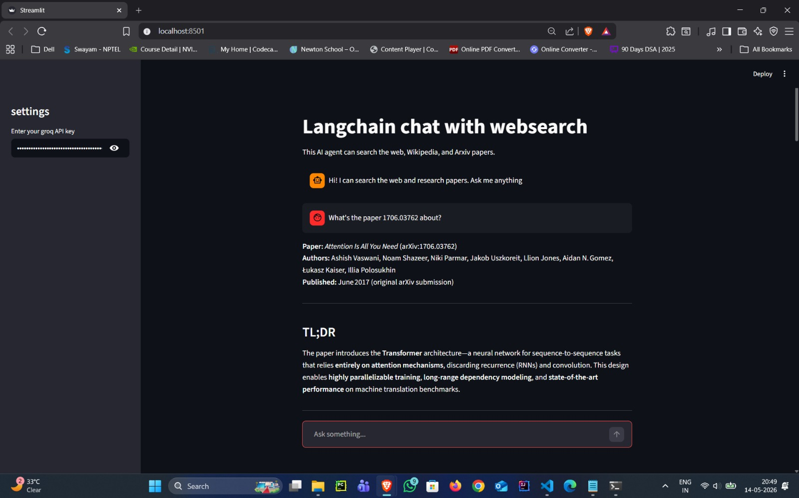

# LangChain Agents and Tools

This repository contains hands-on implementations and learning examples for **LangChain Tools and Agents** using modern LangChain 1.x APIs.

The project demonstrates how Large Language Models (LLMs) can interact with external tools such as:
-  Web Search
-  Wikipedia
-  Arxiv Research Papers

It also includes a Streamlit-based AI assistant capable of performing real-time searches and answering user questions using external tools.

---

# 🚀 Features

- LangChain Tools
- LangChain Agents
- Tool Calling
- Chat Memory using Streamlit Session State
- Web Search Integration
- Wikipedia Tool Integration
- Arxiv Research Paper Tool
- Streamlit Chat UI
- Modern `create_agent()` workflow
- Agent Streaming and Execution Observation

---

# 📂 Repository Structure

```bash
├── app.py
├── requirements.txt
├── tools_agents.ipynb
├── sample_screenshot.jpeg
└── .gitignore
```

---

# 📘 Notebook Contents

The notebook covers:

- What Tools are in LangChain
- What Agents are in LangChain
- Difference between Tools and Agents
- Tool Calling
- Wikipedia Tool
- Arxiv Tool
- Search Tool
- Agent Execution
- Modern LangChain 1.x Agent APIs
- Agent Streaming
- Conversational Memory
- Real-world examples and interview definitions

---

# 🛠️ Tech Stack

- Python
- LangChain
- LangChain Community
- Streamlit
- Groq API
- DuckDuckGo Search
- Wikipedia API
- Arxiv API

---

# ⚙️ Installation

## 1. Clone Repository

```bash
git clone https://github.com/shaik-zaid/langchain-agents-and-tools.git

cd langchain-agents-and-tools
```

---

## 2. Create Virtual Environment

```bash
conda create -p venv python=3.12 -y
```

Activate environment:

### Windows

```bash
venv\Scripts\activate
```

---

## 3. Install Dependencies

```bash
pip install -r requirements.txt
```

---

# 🔑 Environment Variables

Create a `.env` file:

```env
GROQ_API_KEY=your_api_key_here
```

---

# ▶️ Run Streamlit App

```bash
streamlit run app.py
```

---

# 💡 Example Queries

- What is LangChain?
- Latest AI news
- Recent papers on RAG
- Explain Attention Is All You Need
- NVIDIA stock updates
- What are AI agents?

---

# 🧠 Concepts Learned

- LLM + Tools Integration
- Tool Invocation
- Agent Reasoning
- Streamlit Chat Interfaces
- Session State Memory
- External API Integration
- LangChain 1.x Agent Workflow
- Streaming Agent Responses

---

# 📸 Screenshot



---

# 📌 Future Improvements

- Add persistent memory
- Add streaming UI
- Add custom tools
- Add vector database integration
- Deploy on Streamlit Cloud
- Add voice input/output

---

# 📜 License

This repository is created for learning and educational purposes.